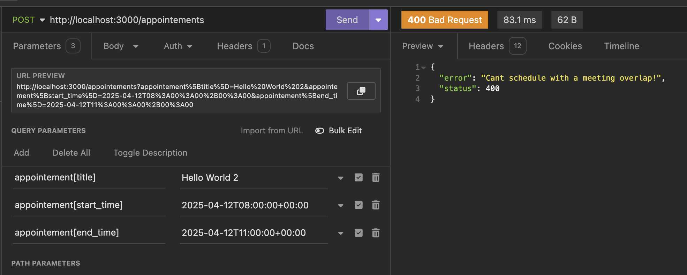
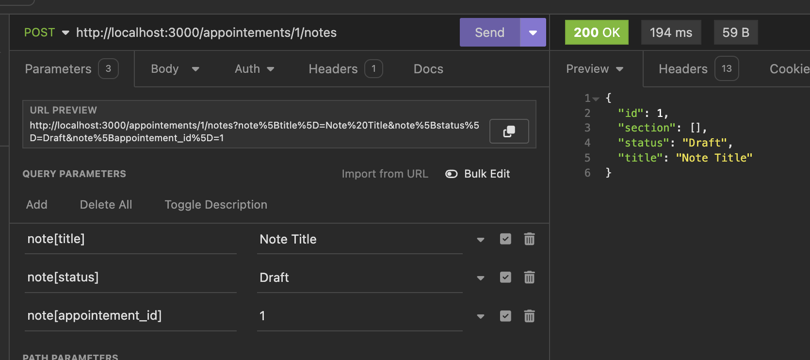
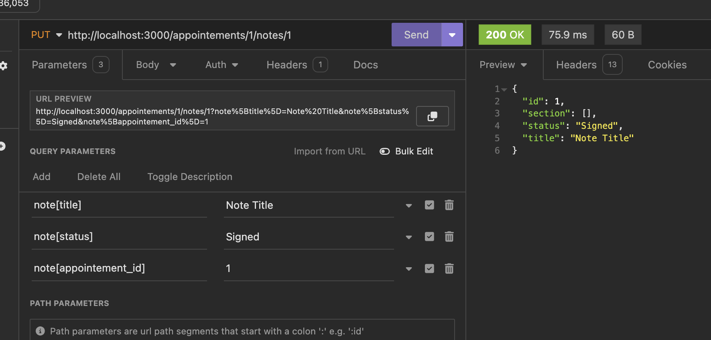
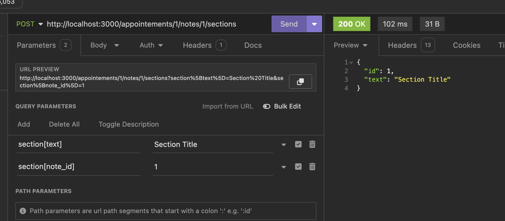
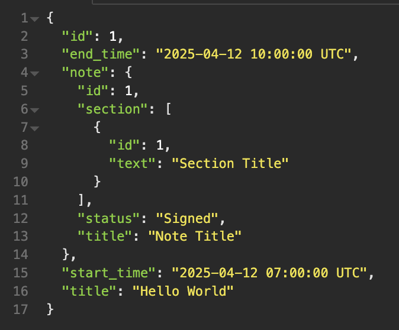

# SpringHealth Challenge

The original challenge

- Create appointements that won't allow overlapping schedule. Each appointement should have a note, that if "signed" cannot be edited. Each note is then allowed to have multiple sections within it, just regular text storage there.

Testing directions:

- Setup your environemnt, starting with `bundle install`. During my development, I encountered failing bundle builds due to outdated bundler so `sudo bundle update --bundler` was also helpful.
- Run `rake db:reset db:migrate` to make sure the db does all the migrations & seedings.
- Run `rails server`
- Note that I did lower authentication requirenments(in controllers) so no token will be necessary to test in your API testing platform of choice. I was using Insomnia.
- In your browser you can head to `http://localhost:3000/appointements` to check out the seed data & its shape.
- Back to Insmonia, here are a couple of tests we can run, best to follow them all for easier QA experience but feel free to have fun with it too! The project isn't perfect and I'm sure could be hacked to be broken in some ways.

Creating an appointment

- Using `http://localhost:3000/appointements` as the base, add url parameters for appointement[title], appointement[start_time], appointement[end_time] similar to screenshot. The reason we do this syntax is because controllers expect an object, and this is the syntax Insomnia uses to support that. Note that the notes is [] because its possible to have an appointement where notes haven't started yet. For easy copy & paste the values I used are `2025-04-12T07:00:00+00:00` and `2025-04-12T10:00:00+00:00`.

Attempting to create an appointment when there is a scheduling overlap

- Alright now lets try to send it again w/o changes, that should easily fill the criteria for overlap. It will return an error `Cant schedule with a meeting overlap!`.
- Now something more complicated, use appointement[start_time] as `2025-04-12T08:00:00+00:00` and appointement[end_time] as `2025-04-12T11:00:00+00:00`

Updating a no-conflict appointment

- Switch from Post to Put. Use appointement[start_time] as `2025-04-12T22:00:00+00:00` and appointement[end_time] as `2025-04-12T23:00:00+00:00`

Creating a note

- Set a POST to `http://localhost:3000/appointements/1/notes`, configure `note[title]`, `note[status]` and `note[appointement_id]` similar to the screenshot

Making the note signed

- As part of the PUT request you can set the status to be Signed.

Attempting to edit a signed note

- Now that the note is signed, it wont allow any editing.

Creating a section

- There are other methods for the note & section as well, but I figured no need to go that deep :D Here's the last instruction!

The final stucture would then look like

