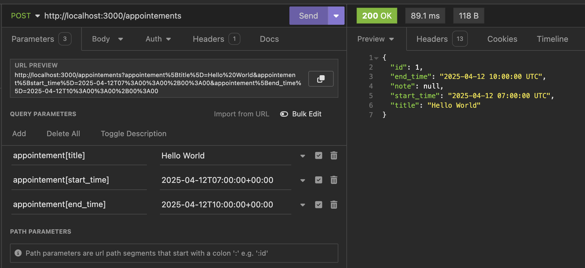

# SpringHealth Challenge

Testing directions:

- Setup your environemnt, starting with `bundle install`. During my development, I encountered failing bundle builds due to outdated bundler so `sudo bundle update --bundler` was also helpful.
- Run `rake db:reset db:migrate` to make sure the db does all the migrations & seedings.
- Run `rails server`
- Note that I did lower authentication requirenments(in controllers) so no token will be necessary to test in your API testing platform of choice. I was using Insomnia.
- In your browser you can head to `http://localhost:3000/appointements` to check out the seed data & its shape.
- Back to Insmonia, here are a couple of tests we can run, best to follow them all for easier QA experience but feel free to have fun with it too! The project isn't perfect and I'm sure could be hacked to be broken in some ways.

Creating an appointment

Using `http://localhost:3000/appointements` as the base, add url parameters for appointement[title], appointement[start_time], appointement[end_time] similar to screenshot. The reason we do this syntax is because controllers expect an object, and this is the syntax Insomnia uses to support that. Note that the notes is [] because its possible to have an appointement where notes haven't started yet.

Attempting to edit an appointment when there is a scheduling overlap

Updating a no-confluct appointment

Creating a note

Making the note signed

Attempting to edit a signed note

Updating a draft note

Creating a section
